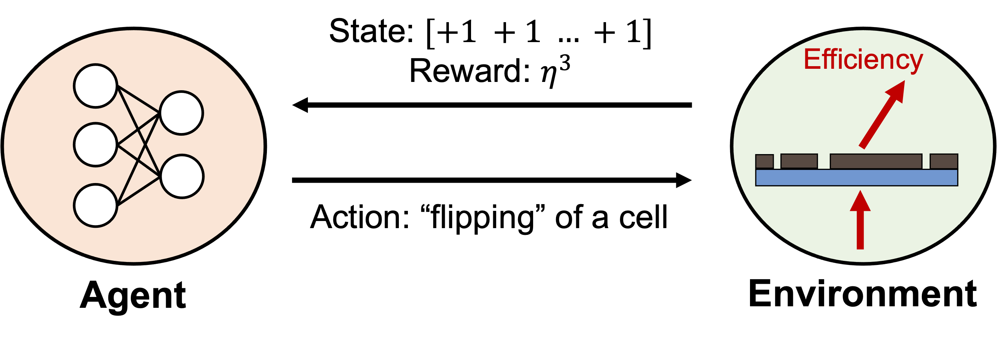
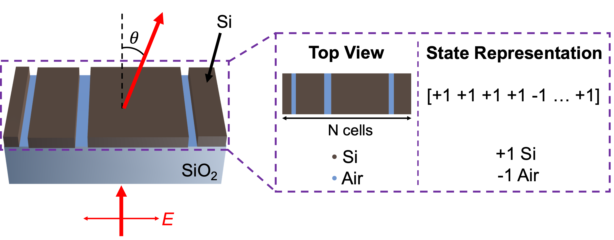

# 1DFreeFormDQN

## Design code of 1D free-from deflector [metasurface](https://en.wikipedia.org/wiki/Electromagnetic_metasurface) based on [Reinforcement Learning](https://en.wikipedia.org/wiki/Reinforcement_learning)

The codes and the optimized structures are provided following the paper named: [Structural Optimization of 1D Freeform Metagrating Deflector via Deep Reinforcement Learning][paper link]

## target condition

The target is to learn the structure-efficiency relation for multiple deflection angles / near-infrared wavelengths. 
Each condition is learned by the same network architecture, showing the robustness of input condition of the network.

The performance was checked for: wavelength of 900nm, 1000nm, 1100nm / deflection angle of 50°, 60°, 70°. The value can vary following the needs of users. Please refer to the paper[link] for further information.

## algorithm

The code formulates the environment of RL and utilizes Deep Q Network, which is a basic algorithm of Reinforcement Learning.

In addition to the best efficiency of structure generated by the algorithm, we also plotted the "validation" efficiency, which is an average value of 10(can vary) episodes with epsilon value 1%. This is for observing the development of algorithm as the process goes by.

## simulation
The simulation which corresponds to the environment in RL framework runs on MATLAB RCWA open source [Reticolo](https://zenodo.org/record/3610175#.YBkECS2UGX0) and the simulation code in `./solvers` is borrowed from [Jonathan Fan group GLOnet github](https://github.com/jonfanlab/GLOnet). After downloading Reticolo, change the file named `deflector_reticolo.py` in line 15 to: 

self.eng.addpath(self.eng.genpath(r'*the path that you downloaded reticolo*'));

## example
~~~
python main.py --wavelength=900 --angle=60 --eps_greedy_period=1000000
~~~
The configuration of default conditions is written in `./config/config.json` file.

## installation
If you install it without any version control of environments, type 
~~~
pip install -r requirements.txt
~~~

or for Anaconda,
~~~
conda install -r requirements.txt
~~~

If you do not own MATLAB but use RETICOLO as a simulation tool, you will additionally need a MATLAB engine. Please refer to the site below:
https://www.mathworks.com/help/matlab/matlab_external/install-the-matlab-engine-for-python.html

## optimized structures
The optimized structures are saved as .np files in `./structures` folder.

## citation
If you cite the code, please refer to: [paper link]
