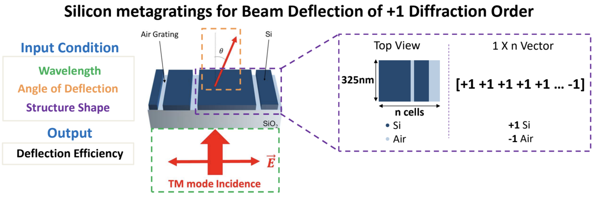

# 1DFreeFormDQN
Design code of 1D free-from deflector metasurface

## target condition
To learn the structure-efficiency relation for multiple deflection angles / near-infrared wavelengths. 
Each condition is learned by a same network architecture, showing the robustness of input condition of the network.

The performance was checked for: wavelength of 900nm, 1000nm, 1100nm / deflection angle of 50°, 60°, 70°. Please refer to the paper(link) for further information.
 

## algorithm

The code utilizes Deep Q Network, which is a basic algorithm of Reinforcement Learning.

In addition to the best efficiency of structure generated by the algorithm, we also plotted the "validation" efficiency, which is an average value of 10(can vary) episodes with epsilon value 1%. This is for observing the development of algorithm as the process goes by.

## benchmark
The environment benchmark can be obtained @ [Jonathan Fan group GLOnet github](https://github.com/jonfanlab/GLOnet))

## simulation
The simulation which corresponds to the environment in RL framework runs on MATLAB RCWA open source [Reticolo](https://zenodo.org/record/3610175#.YBkECS2UGX0)

## example
~~~
python main.py --wavelength=900 --angle=60 --eps_greedy_period=1000000
~~~
The configuration of default conditions are written in './config/config.json' file.

## installation
If you install it without any version control of environments, type 
~~~
pip install requirements.txt
~~~

or for Anaconda,
~~~
conda install requirements.txt
~~~

If you use RETOCOLO as a simulation tool, you will additionally need MATLAB engine. Please refer to the site below:
https://www.mathworks.com/help/matlab/matlab_external/install-the-matlab-engine-for-python.html

## optimized structures
The optimized structures are saved as .np files in ./structure folder
